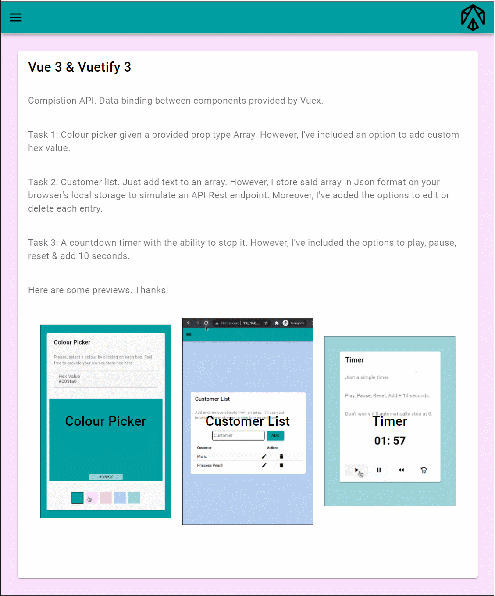
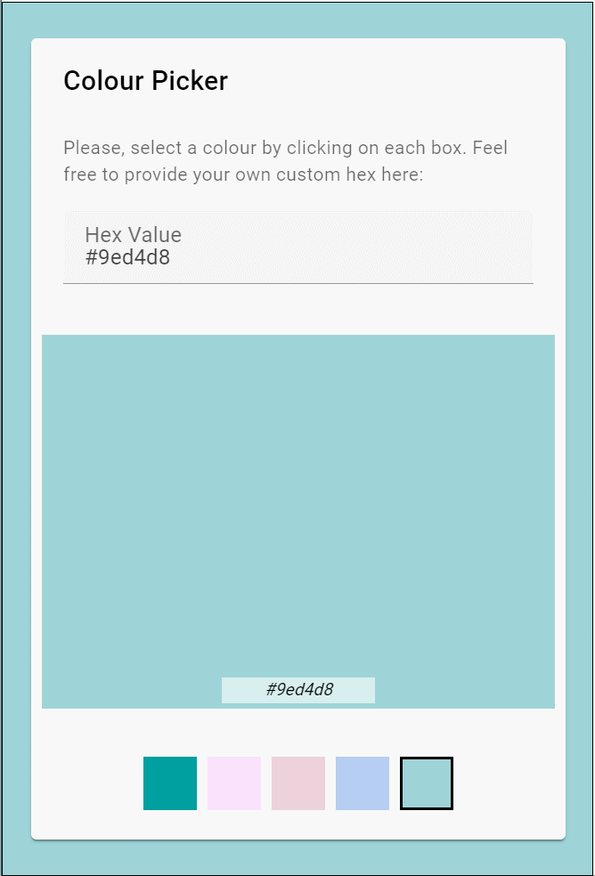
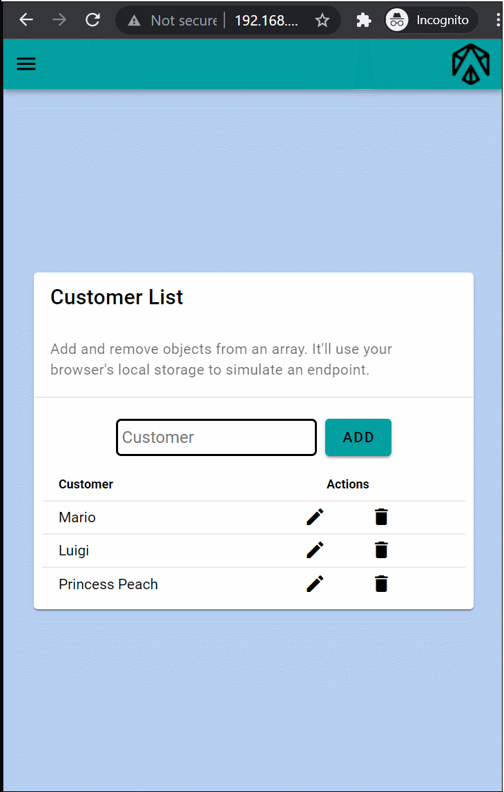
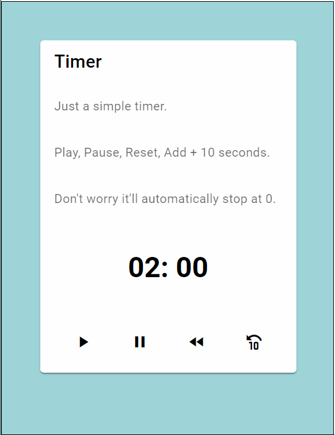

# Austin Test
Vue 3 Composition API + Vuex + Router + Vuetify 3 

# [LINK](https://bakeluco.github.io/austintest/)
## Light & Dark Mode Available

## Colour Picker Component
### Interacting with store to bind data!
Task 1: Colour picker given a provided prop type Array. However, I've included an option to add custom hex value.

## Customer List Component
### Persistant data thanks to your browser's Local Storage.
Task 2: Customer list. Just add text to an array. However, I store said array in Json format on your browser's local storage to simulate an API Rest endpoint. Moreover, I've added the options to edit or delete each entry.
### Create, Read, Update & Destroy customers from your list!

## Timer Component
### Got seconds? I'll give you minutes!
Task 3: A countdown timer with the ability to stop it. However, I've included the options to play, pause, reset & add 10 seconds.
### Play, pause, rewind, +10 seconds!

